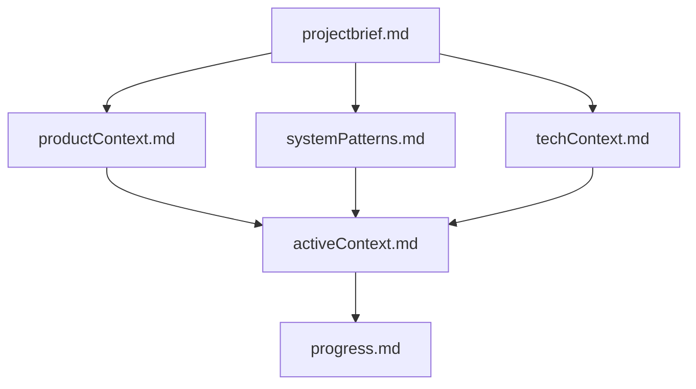
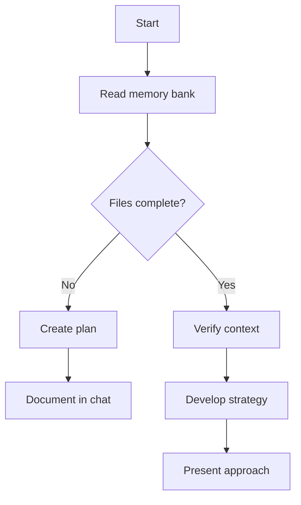
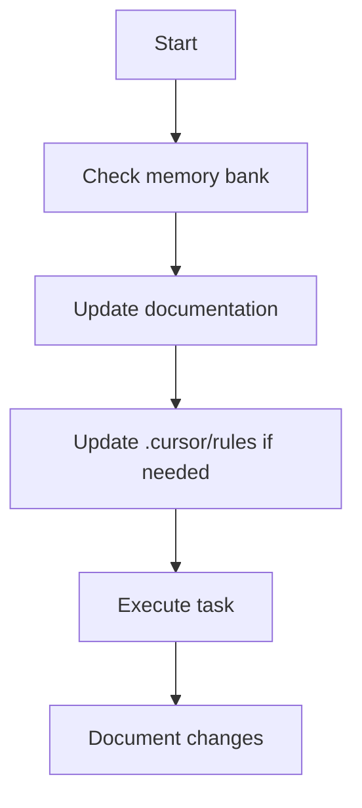
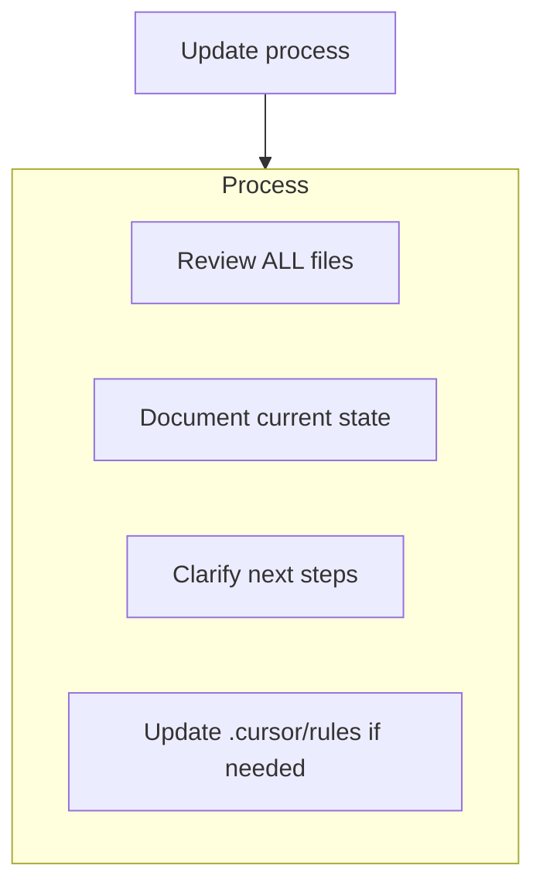
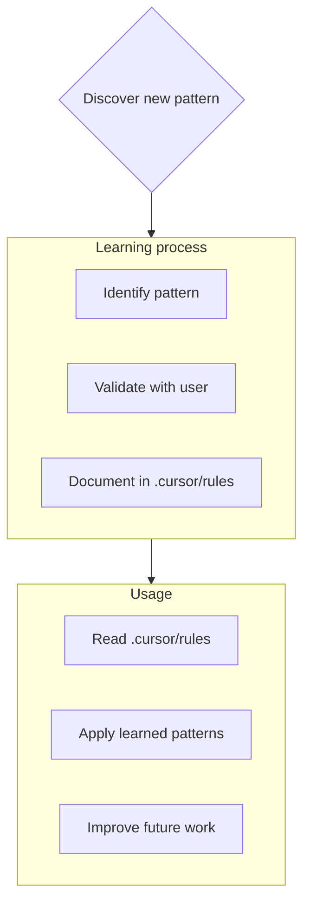

# Claude Code — project context

<!-- cloude-code-toolbox:mcp-skills-awareness-begin -->

### MCP & Skills awareness (Cloude Code ToolBox)

_Last synced: 2026-04-05T20:06:30.132Z._

- **Full report:** `.claude/cloude-code-toolbox-mcp-skills-awareness.md` in this workspace (auto-overwritten on each scan). Use it as ground truth for configured servers and skill folders.
- **MCP:** For **live tools** in Claude Code, enable the matching server via `/mcp` (and VS Code `mcp.json` where applicable).
- **When the user’s task matches a server** (e.g. Confluence work and a **Confluence** / **Atlassian** MCP is listed), **prefer that server id** and plan on tool use—not only file search.
- **Skills:** Folders below contain `SKILL.md`; attach or cite paths in chat when relevant.

#### Workspace MCP

- `/home/madhusudan/Pictures/special-winner/.vscode/mcp.json` _(workspace: special-winner)_ — _file missing_

_No active workspace servers in mcp.json._

#### User MCP

- `/home/madhusudan/.config/Code/User/mcp.json` — _no servers defined_

_No active user-scoped servers in mcp.json._

#### Project skills

_None found (or no workspace open)._

#### User skills

- **appinsights-instrumentation** — `/home/madhusudan/.agents/skills/appinsights-instrumentation` — Guidance for instrumenting webapps with Azure Application Insights. Provides telemetry patterns, SDK setup, and configuration references. WHEN: how to instrument app, App Insights SDK, telemetry patterns, what is App Ins

- **azure-ai** — `/home/madhusudan/.agents/skills/azure-ai` — Use for Azure AI: Search, Speech, OpenAI, Document Intelligence. Helps with search, vector/hybrid search, speech-to-text, text-to-speech, transcription, OCR. WHEN: AI Search, query search, vector search, hybrid search, s

- **azure-aigateway** — `/home/madhusudan/.agents/skills/azure-aigateway` — Configure Azure API Management as an AI Gateway for AI models, MCP tools, and agents. WHEN: semantic caching, token limit, content safety, load balancing, AI model governance, MCP rate limiting, jailbreak detection, add 

- **azure-cloud-migrate** — `/home/madhusudan/.agents/skills/azure-cloud-migrate` — Assess and migrate cross-cloud workloads to Azure with migration reports and code conversion guidance. Supports AWS, GCP, and other providers. WHEN: migrate Lambda to Azure Functions, migrate AWS to Azure, Lambda migrati

- **azure-compliance** — `/home/madhusudan/.agents/skills/azure-compliance` — Run Azure compliance and security audits with azqr plus Key Vault expiration checks. Covers best-practice assessment, resource review, policy/compliance validation, and security posture checks. WHEN: compliance scan, sec

- **azure-compute** — `/home/madhusudan/.agents/skills/azure-compute` — Azure VM and VMSS router for recommendations, pricing, autoscale, orchestration, and connectivity troubleshooting. WHEN: Azure VM, VMSS, scale set, recommend, compare, server, website, burstable, lightweight, VM family, 

- **azure-cost** — `/home/madhusudan/.agents/skills/azure-cost` — Unified Azure cost management: query historical costs, forecast future spending, and optimize to reduce waste. WHEN: \"Azure costs\", \"Azure spending\", \"Azure bill\", \"cost breakdown\", \"cost by service\", \"cost by

- **azure-deploy** — `/home/madhusudan/.agents/skills/azure-deploy` — Execute Azure deployments for ALREADY-PREPARED applications that have existing .azure/deployment-plan.md and infrastructure files. DO NOT use this skill when the user asks to CREATE a new application — use azure-prepare 

- **azure-diagnostics** — `/home/madhusudan/.agents/skills/azure-diagnostics` — Debug Azure production issues on Azure using AppLens, Azure Monitor, resource health, and safe triage. WHEN: debug production issues, troubleshoot container apps, troubleshoot functions, troubleshoot AKS, kubectl cannot 

- **azure-enterprise-infra-planner** — `/home/madhusudan/.agents/skills/azure-enterprise-infra-planner` — Architect and provision enterprise Azure infrastructure from workload descriptions. For cloud architects and platform engineers planning networking, identity, security, compliance, and multi-resource topologies with WAF 

- **azure-hosted-copilot-sdk** — `/home/madhusudan/.agents/skills/azure-hosted-copilot-sdk` — Build, deploy, modify GitHub Copilot SDK apps on Azure. PREFER OVER azure-prepare when codebase contains copilot-sdk markers. WHEN: copilot SDK, @github/copilot-sdk, copilot-powered app, deploy copilot app, add feature, 

- **azure-kubernetes** — `/home/madhusudan/.agents/skills/azure-kubernetes` — Plan, create, and configure production-ready Azure Kubernetes Service (AKS) clusters. Covers Day-0 checklist, SKU selection (Automatic vs Standard), networking options (private API server, Azure CNI Overlay, egress confi

- **azure-kusto** — `/home/madhusudan/.agents/skills/azure-kusto` — Query and analyze data in Azure Data Explorer (Kusto/ADX) using KQL for log analytics, telemetry, and time series analysis. WHEN: KQL queries, Kusto database queries, Azure Data Explorer, ADX clusters, log analytics, tim

- **azure-messaging** — `/home/madhusudan/.agents/skills/azure-messaging` — Troubleshoot and resolve issues with Azure Messaging SDKs for Event Hubs and Service Bus. Covers connection failures, authentication errors, message processing issues, and SDK configuration problems. WHEN: event hub SDK 

- **azure-prepare** — `/home/madhusudan/.agents/skills/azure-prepare` — Prepare Azure apps for deployment (infra Bicep/Terraform, azure.yaml, Dockerfiles). Use for create/modernize or create+deploy; not cross-cloud migration (use azure-cloud-migrate). WHEN: \"create app\", \"build web app\",

- **azure-quotas** — `/home/madhusudan/.agents/skills/azure-quotas` — Check/manage Azure quotas and usage across providers. For deployment planning, capacity validation, region selection. WHEN: \"check quotas\", \"service limits\", \"current usage\", \"request quota increase\", \"quota exc

- **azure-rbac** — `/home/madhusudan/.agents/skills/azure-rbac` — Helps users find the right Azure RBAC role for an identity with least privilege access, then generate CLI commands and Bicep code to assign it. Also provides guidance on permissions required to grant roles. WHEN: bicep f

- **azure-resource-lookup** — `/home/madhusudan/.agents/skills/azure-resource-lookup` — List, find, and show Azure resources across subscriptions or resource groups. Handles prompts like \"list websites\", \"list virtual machines\", \"list my VMs\", \"show storage accounts\", \"find container apps\", and \"

- **azure-resource-visualizer** — `/home/madhusudan/.agents/skills/azure-resource-visualizer` — Analyze Azure resource groups and generate detailed Mermaid architecture diagrams showing the relationships between individual resources. WHEN: create architecture diagram, visualize Azure resources, show resource relati

- **azure-storage** — `/home/madhusudan/.agents/skills/azure-storage` — Azure Storage Services including Blob Storage, File Shares, Queue Storage, Table Storage, and Data Lake. Provides object storage, SMB file shares, async messaging, NoSQL key-value, and big data analytics capabilities. In

- **azure-upgrade** — `/home/madhusudan/.agents/skills/azure-upgrade` — Assess and upgrade Azure workloads between plans, tiers, or SKUs within Azure. Generates assessment reports and automates upgrade steps. WHEN: upgrade Consumption to Flex Consumption, upgrade Azure Functions plan, migrat

- **azure-validate** — `/home/madhusudan/.agents/skills/azure-validate` — Pre-deployment validation for Azure readiness. Run deep checks on configuration, infrastructure (Bicep or Terraform), RBAC role assignments, managed identity permissions, and prerequisites before deploying. WHEN: validat

- **entra-app-registration** — `/home/madhusudan/.agents/skills/entra-app-registration` — Guides Microsoft Entra ID app registration, OAuth 2.0 authentication, and MSAL integration. USE FOR: create app registration, register Azure AD app, configure OAuth, set up authentication, add API permissions, generate s

- **microsoft-foundry** — `/home/madhusudan/.agents/skills/microsoft-foundry` — Deploy, evaluate, and manage Foundry agents end-to-end: Docker build, ACR push, hosted/prompt agent create, container start, batch eval, prompt optimization, prompt optimizer workflows, agent.yaml, dataset curation from

<!-- cloude-code-toolbox:mcp-skills-awareness-end -->
<!-- cloude-code-memory-bank:begin -->
# Plan / Act workflow (Cursor-style)

Unless the user clearly opts out (e.g. **"skip plan, implement now"** or **"just fix it"** with no ambiguity), use **two modes**. This matches Cursor’s PLAN → approve → ACT flow.

## Plan mode (default)

- **First line of every Plan-mode response MUST be exactly:** `# Mode: PLAN`
- **Do not modify the repository in any way**, including:
  - No creating, editing, or deleting files (source, config, docs, **including `./memory-bank/**` memory-bank files**).
  - No applying multi-file edits, quick fixes, or patch-style changes.
  - No terminal commands that change the workspace (installs, builds that write outputs you were asked to apply, `git` writes, etc.).
- **Allowed in Plan mode:** Read/search files to understand the codebase, answer questions, list steps, identify risks, and produce a **written plan** (markdown).
- **End Plan-mode responses** by telling the user how to proceed, e.g. **Type `ACT` when you approve this plan** (or ask them to refine the plan first).

## Act mode

- Enter **only** when the user’s message **clearly approves implementation**, e.g. they send **`ACT`**, **`act`**, or phrases like **"go ahead"**, **"implement the plan"**, **"approved"** right after a plan—or they explicitly told you to skip planning and implement.
- **First line of every Act-mode response MUST be exactly:** `# Mode: ACT`
- **Then** you may edit files, run commands, and update **`./memory-bank/`** when appropriate.
- After you finish an Act-mode turn, assume the next user message starts in **Plan mode** again unless they again approve with **`ACT`** (or equivalent) for further edits.

## If the user asks for code changes while you are in Plan mode

- **Do not implement.** Respond with `# Mode: PLAN`, briefly restate or adjust the plan, and ask them to type **`ACT`** when they want you to apply changes.

---

# Memory bank (persistent context)

This repository uses a **memory bank** under `./memory-bank/` — structured markdown that survives sessions, similar to Cursor-style workflows.

Context layers (read deeper files after foundations): **projectbrief** → **productContext** / **systemPatterns** / **techContext** → **activeContext** → **progress**.

## What Claude should do

1. **Before substantive work**, read **all** of the following under `./memory-bank/` when the task depends on project state (not optional for non-trivial work). In **Plan mode**, reading for the plan is allowed; **do not edit** these files until **Act mode** unless the user only asked for a documentation/memory update with no code change.
   - `projectbrief.md` — scope and goals
   - `productContext.md` — product intent and UX
   - `systemPatterns.md` — architecture and conventions
   - `techContext.md` — stack and constraints
   - `progress.md` — done / pending / known issues
   - `activeContext.md` — current task and decisions

2. **During Act-mode work**, keep `activeContext.md` aligned with the current task (update when focus shifts).

3. **After meaningful milestones** (in Act mode), update `progress.md` and any affected docs in `./memory-bank/`.

4. When the user asks to **update memory bank** (or similar), **open and review every** file in `./memory-bank/`, then update what changed — especially `activeContext.md` and `progress.md`, even if other files are unchanged. Prefer doing heavy memory-bank writes in **Act mode** unless the user asked for documentation-only updates.

5. Prefer **short, factual updates** over long prose. Reference files, symbols, and tickets instead of duplicating code.

Do not delete these files; evolve them as the project changes.
<!-- cloude-code-memory-bank:end -->

<!-- cursor-rules-to-claude:always-begin -->
<!-- Generated by cursor-rules-to-claude — re-run after changing Cursor rules. -->

# Project instructions (from Cursor rules)

## .cursor/rules/core.mdc

<!-- Source: .cursor/rules/core.mdc -->
## Core rules — Plan / Act (match GitHub Copilot instructions)

You have two modes of operation:

1. **Plan mode** — Work with the user to define a plan; **do not change the codebase** until the user approves.
2. **Act mode** — Make changes based on the approved plan.

### Plan mode (default)

- **First line MUST be:** `# Mode: PLAN`
- **Do not** create, edit, or delete any files (including under the memory bank path), apply patches, or run terminal commands that modify the workspace—**only** read/search, discuss, and output the plan in markdown.
- Stay in Plan mode until the user explicitly approves (e.g. **`ACT`**).
- If the user asks for edits while in Plan mode, respond with `# Mode: PLAN`, remind them you need approval first, and ask them to type **`ACT`** when ready.
- In Plan mode, include the **full updated plan** in every response.
- End by telling the user to type **`ACT`** to implement (or refine the plan).

### Act mode

- **First line MUST be:** `# Mode: ACT`
- Enter only after clear approval (**`ACT`**, **"go ahead"**, **"implement the plan"**, or user explicitly skipped planning).
- Then you may edit files, run commands, and update documentation.
- After completing Act-mode work for that turn, the next user message starts in **Plan mode** again unless they send **`ACT`** for more edits.

### Exceptions

- If the user clearly says to **skip the plan** and implement immediately, you may use `# Mode: ACT` and proceed.

## .cursor/rules/memory-bank.mdc

<!-- Source: .cursor/rules/memory-bank.mdc -->
> Persistent project memory via markdown files (memory bank)

# Cursor memory bank

You are an AI assistant whose **session memory resets**. Treat the **memory bank** as the durable source of truth for project context. At the **start of every substantive task**, read **all** memory bank files under `./memory-bank/` — this is not optional when the task depends on project state.

## Memory bank structure

Core files (Markdown), in hierarchy order (all under `./memory-bank/`):

### Core files (required)

1. `./memory-bank/projectbrief.md` — Scope, goals, source of truth for what “done” means.
2. `./memory-bank/productContext.md` — Why the product exists, problems solved, UX goals.
3. `./memory-bank/activeContext.md` — Current focus, recent changes, next steps, active decisions.
4. `./memory-bank/systemPatterns.md` — Architecture, technical decisions, patterns, component relationships.
5. `./memory-bank/techContext.md` — Stack, setup, constraints, dependencies.
6. `./memory-bank/progress.md` — What works, what is left, status, known issues.

### Additional context

Add files or subfolders under `./memory-bank/` when useful (integrations, APIs, testing, deployment, etc.).

## Workflows

### Plan mode

### Act mode

## Documentation updates

Update the memory bank when:

1. You discover new project patterns.
2. You finish significant implementation work.
3. The user asks to **update memory bank** — then **review every** memory bank file (even if most need no edit). Pay extra attention to `activeContext.md` and `progress.md`.
4. Context is unclear and needs clarification.

## Project intelligence (`.cursor/rules`)

Use `.cursor/rules` as a **learning journal**: preferences, non-obvious patterns, tooling, and decisions that are not already captured in code or the memory bank.

### What to capture

- Critical implementation paths and conventions
- User preferences and workflow
- Project-specific patterns and pitfalls
- How decisions evolved

**Remember:** after a reset, the memory bank (and `.cursor/rules`) is your continuity. Keep them accurate and concise.
<!-- cursor-rules-to-claude:always-end -->